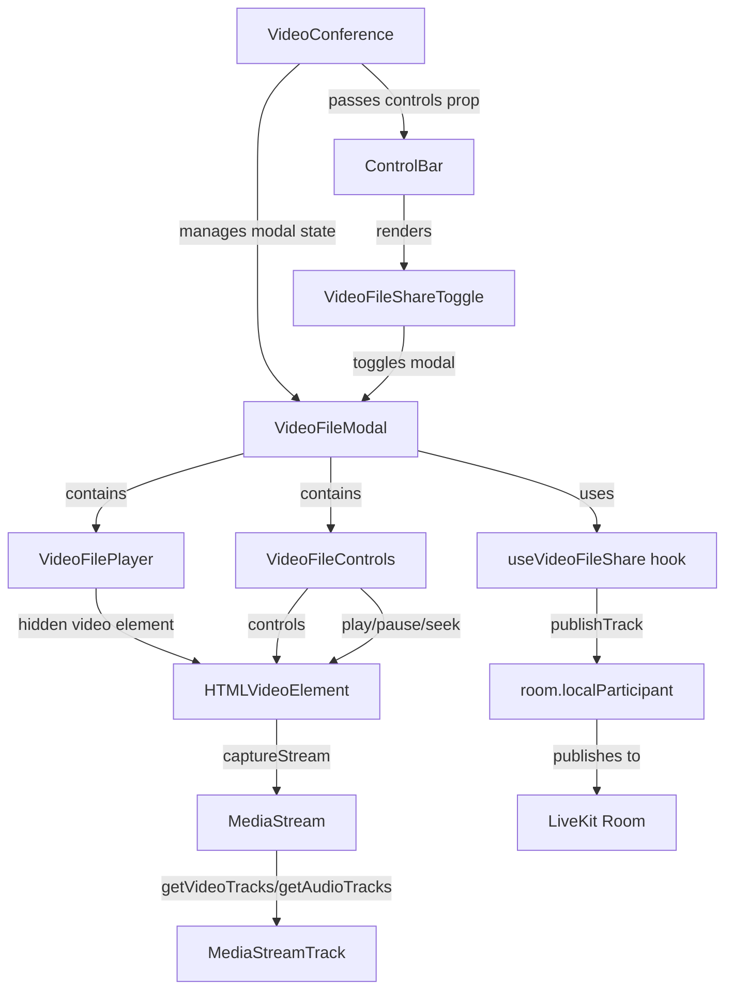

# Video File Share Feature - Architecture Plan

## Overview
Add functionality to share local video files in LiveKit video conference as a separate track alongside the camera feed. Users can select a video file, control playback (play/pause/seek), and share it with other participants.

## Architecture Diagram



## Component Structure

### 1. Core Hook: `useVideoFileShare`
**Location:** `lib/hooks/useVideoFileShare.ts`

**Purpose:** Manage video file sharing lifecycle, stream capture, and track publishing.

**State:**
- `videoElement: HTMLVideoElement | null` - Reference to video element
- `isSharing: boolean` - Whether currently sharing
- `videoTrack: LocalVideoTrack | null` - Published video track
- `audioTrack: LocalAudioTrack | null` - Published audio track
- `error: Error | null` - Error state

**Methods:**
- `startSharing(file: File): Promise<void>` - Load file and start sharing
- `stopSharing(): Promise<void>` - Stop sharing and unpublish tracks
- `setVideoElement(element: HTMLVideoElement): void` - Set video element reference

**Implementation Details:**
```typescript
// Capture stream from video element
const stream = videoElement.captureStream();
const [videoTrack] = stream.getVideoTracks();
const [audioTrack] = stream.getAudioTracks();

// Publish tracks to room
await room.localParticipant.publishTrack(videoTrack, {
  name: 'shared-video',
  source: Track.Source.Camera, // or custom source
});

if (audioTrack) {
  await room.localParticipant.publishTrack(audioTrack, {
    name: 'shared-audio',
  });
}
```

### 2. VideoFilePlayer Component
**Location:** `lib/components/conference/videoFileShare/VideoFilePlayer.tsx`

**Purpose:** Hidden video element that plays the file and provides stream for capture.

**Props:**
```typescript
interface VideoFilePlayerProps {
  file: File | null;
  onVideoElementReady: (element: HTMLVideoElement) => void;
  onError: (error: Error) => void;
  onEnded: () => void;
}
```

**Features:**
- Hidden video element (display: none or visibility: hidden)
- Auto-load file when provided
- Error handling for unsupported formats
- Emit events for playback lifecycle

### 3. VideoFileControls Component
**Location:** `lib/components/conference/videoFileShare/VideoFileControls.tsx`

**Purpose:** UI controls for video playback (play/pause, seek, volume, speed).

**Props:**
```typescript
interface VideoFileControlsProps {
  videoElement: HTMLVideoElement | null;
  isPlaying: boolean;
  currentTime: number;
  duration: number;
  volume: number;
  playbackRate: number;
  onPlayPause: () => void;
  onSeek: (time: number) => void;
  onVolumeChange: (volume: number) => void;
  onPlaybackRateChange: (rate: number) => void;
}
```

**UI Elements:**
- Play/Pause button
- Timeline slider (seek bar)
- Current time / Duration display
- Volume slider
- Playback speed selector (0.5x, 1x, 1.5x, 2x)
- File name display

### 4. VideoFileModal Component
**Location:** `lib/components/conference/videoFileShare/VideoFileModal.tsx`

**Purpose:** Modal dialog containing file picker, player, and controls.

**Props:**
```typescript
interface VideoFileModalProps {
  isOpen: boolean;
  onClose: () => void;
}
```

**Structure:**
```
┌─────────────────────────────────────┐
│  Share Video File            [X]    │
├─────────────────────────────────────┤
│                                     │
│  [Choose File] or Drag & Drop       │
│                                     │
│  Selected: video.mp4                │
│                                     │
│  ┌─────────────────────────────┐   │
│  │ [▶] ━━━━━━━●━━━━━ 🔊 1x    │   │
│  │ 00:45 / 02:30               │   │
│  └─────────────────────────────┘   │
│                                     │
│  [Start Sharing] [Stop Sharing]     │
│                                     │
└─────────────────────────────────────┘
```

**Features:**
- File input with drag & drop support
- Preview of selected file
- Integrated controls
- Start/Stop sharing buttons
- Close button

### 5. VideoFileShareToggle Component
**Location:** `lib/components/conference/controls/VideoFileShareToggle.tsx`

**Purpose:** Button in ControlBar to toggle video file sharing modal.

**Props:**
```typescript
interface VideoFileShareToggleProps extends React.ButtonHTMLAttributes<HTMLButtonElement> {
  isSharing?: boolean;
}
```

**Features:**
- Icon for video file (e.g., film/video icon)
- Visual indicator when sharing is active
- Tooltip: "Share Video File"

### 6. Modal Toggle Hook
**Location:** `lib/hooks/useVideoFileShareToggle.ts`

**Purpose:** Manage modal visibility state in layout context.

**Similar to:** `useSettingsToggle.ts`

**Implementation:**
```typescript
export function useVideoFileShareToggle({ props }: UseVideoFileShareToggleProps) {
  const layoutContext = useMaybeLayoutContext();
  
  const mergedProps = React.useMemo(() => {
    return {
      ...props,
      className: 'lk-button lk-button-menu',
      onClick: () => {
        layoutContext?.widget.dispatch?.({ msg: 'toggle_video_file_share' });
      },
    };
  }, [props, layoutContext]);
  
  return { mergedProps };
}
```

## Integration Points

### 1. ControlBarControls Type Extension
**File:** `lib/components/conference/ControlBar.tsx`

```typescript
export type ControlBarControls = {
  microphone?: boolean;
  camera?: boolean;
  chat?: boolean;
  screenShare?: boolean;
  leave?: boolean;
  settings?: boolean;
  videoFileShare?: boolean; // NEW
};
```

### 2. ControlBar Integration
**File:** `lib/components/conference/ControlBar.tsx`

Add after screen share button:
```typescript
{visibleControls.videoFileShare && (
  <VideoFileShareToggle>
    {showIcon && <VideoFileIcon />}
    {showText && (isVideoFileSharing ? 'Stop sharing video' : 'Share video file')}
  </VideoFileShareToggle>
)}
```

### 3. VideoConference State Management
**File:** `lib/components/conference/VideoConference.tsx`

Extend `WidgetState`:
```typescript
const [widgetState, setWidgetState] = React.useState<WidgetState>({
  showChat: false,
  unreadMessages: 0,
  showSettings: false,
  showVideoFileShare: false, // NEW
});
```

Add modal rendering:
```typescript
{widgetState.showVideoFileShare && (
  <VideoFileModal
    isOpen={widgetState.showVideoFileShare}
    onClose={() => setWidgetState(prev => ({ ...prev, showVideoFileShare: false }))}
  />
)}
```

## Data Flow

### Starting Video Share
1. User clicks VideoFileShareToggle button
2. Modal opens via layout context dispatch
3. User selects video file via file input
4. File is loaded into hidden video element
5. `useVideoFileShare` hook captures stream from video element
6. Video and audio tracks are published to room via `room.localParticipant.publishTrack()`
7. Other participants see the shared video as a new track

### Controlling Playback
1. User interacts with VideoFileControls (play/pause/seek)
2. Controls directly manipulate the HTMLVideoElement
3. Changes are reflected in the captured stream
4. All participants see the updated video state in real-time

### Stopping Video Share
1. User clicks "Stop Sharing" or closes modal
2. `useVideoFileShare.stopSharing()` is called
3. Tracks are unpublished from room
4. Video element is cleaned up
5. Modal closes

## Technical Considerations

### 1. Track Publishing Options
```typescript
const publishOptions: TrackPublishOptions = {
  name: 'shared-video-file',
  source: Track.Source.Camera, // or create custom source
  simulcast: false, // May not need simulcast for file sharing
  videoCodec: 'vp8', // or 'h264'
};
```

### 2. Video Element Configuration
```typescript
<video
  ref={videoRef}
  style={{ display: 'none' }} // Hidden from UI
  playsInline
  muted={false} // Keep audio
  controls={false}
  onError={handleError}
  onEnded={handleEnded}
  onLoadedMetadata={handleLoaded}
/>
```

### 3. Stream Capture
```typescript
// Ensure video is playing before capturing
await videoElement.play();

// Capture at specific frame rate if needed
const stream = videoElement.captureStream(30); // 30 fps
```

### 4. Error Handling
- Unsupported video formats
- File too large
- Network issues during publishing
- Browser compatibility (captureStream support)

### 5. Cleanup
```typescript
const cleanup = async () => {
  // Stop all tracks
  stream.getTracks().forEach(track => track.stop());
  
  // Unpublish from room
  await room.localParticipant.unpublishTrack(videoTrack);
  await room.localParticipant.unpublishTrack(audioTrack);
  
  // Clear video source
  videoElement.src = '';
  videoElement.load();
};
```

## File Structure

```
lib/
├── components/
│   └── conference/
│       ├── VideoConference.tsx (modified)
│       ├── ControlBar.tsx (modified)
│       ├── controls/
│       │   ├── SettingsMenuToggle.tsx
│       │   └── VideoFileShareToggle.tsx (new)
│       └── videoFileShare/
│           ├── VideoFileModal.tsx (new)
│           ├── VideoFilePlayer.tsx (new)
│           └── VideoFileControls.tsx (new)
└── hooks/
    ├── useVideoFileShare.ts (new)
    └── useVideoFileShareToggle.ts (new)
```

## Styling Considerations

### Modal Styling
- Use existing LiveKit component styles as reference
- Modal overlay with backdrop
- Centered modal dialog
- Responsive design for mobile

### Controls Styling
- Match existing ControlBar button styles
- Use LiveKit's button classes (`lk-button`, etc.)
- Consistent spacing and sizing

### File Input Styling
- Custom styled file input or drag-drop zone
- Visual feedback for drag-over state
- File type and size validation display

## Testing Strategy

1. **Unit Tests:**
   - `useVideoFileShare` hook logic
   - Component rendering
   - Event handlers

2. **Integration Tests:**
   - File selection flow
   - Stream capture and publishing
   - Playback controls
   - Modal open/close

3. **Manual Testing:**
   - Different video formats (mp4, webm, mov)
   - Different file sizes
   - Multiple participants viewing shared video
   - Network conditions
   - Browser compatibility

## Browser Compatibility

- `HTMLVideoElement.captureStream()` support:
  - Chrome/Edge: ✅ Full support
  - Firefox: ✅ Full support
  - Safari: ✅ Support (with webkit prefix in older versions)
  
- Fallback: Display error message if not supported

## Future Enhancements

1. Video preview in modal before sharing
2. Loop option for continuous playback
3. Multiple file queue
4. Screen recording as alternative to file upload
5. Video filters/effects before sharing
6. Synchronized playback across participants
7. Playlist management
8. Cloud storage integration (Google Drive, Dropbox)

## Implementation Priority

**Phase 1 (MVP):**
- Core hook with basic sharing
- Simple modal with file picker
- Basic play/pause controls
- ControlBar integration

**Phase 2 (Enhanced):**
- Full playback controls (seek, volume, speed)
- Share controls with other members using RPC fuctionality
- Full screen mode
